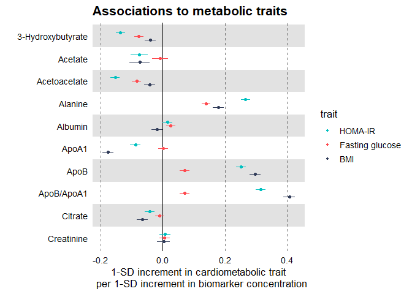
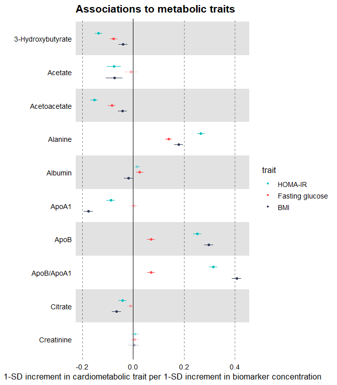
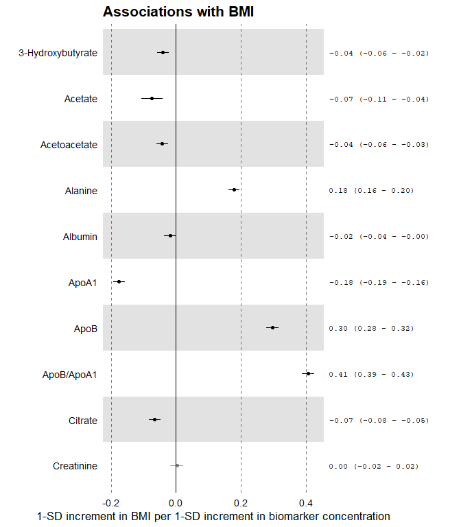
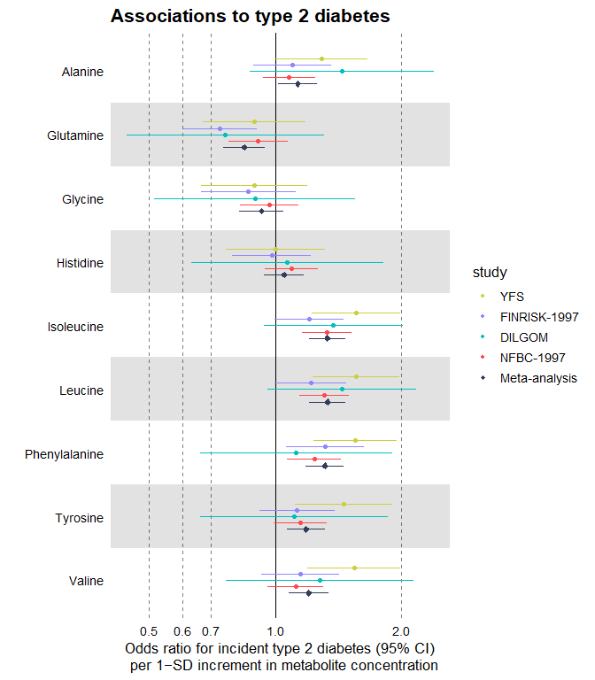
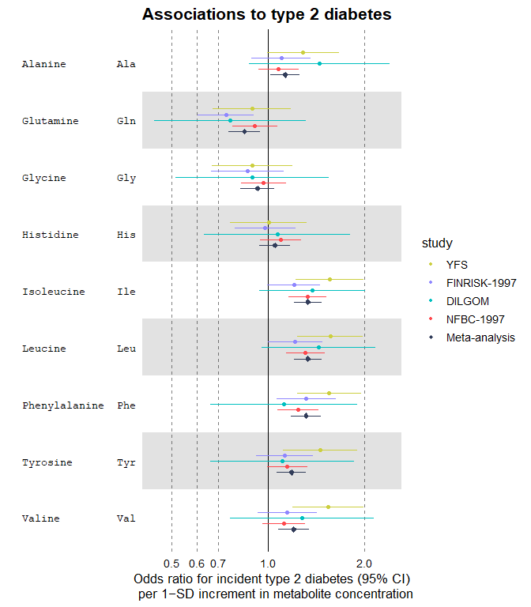
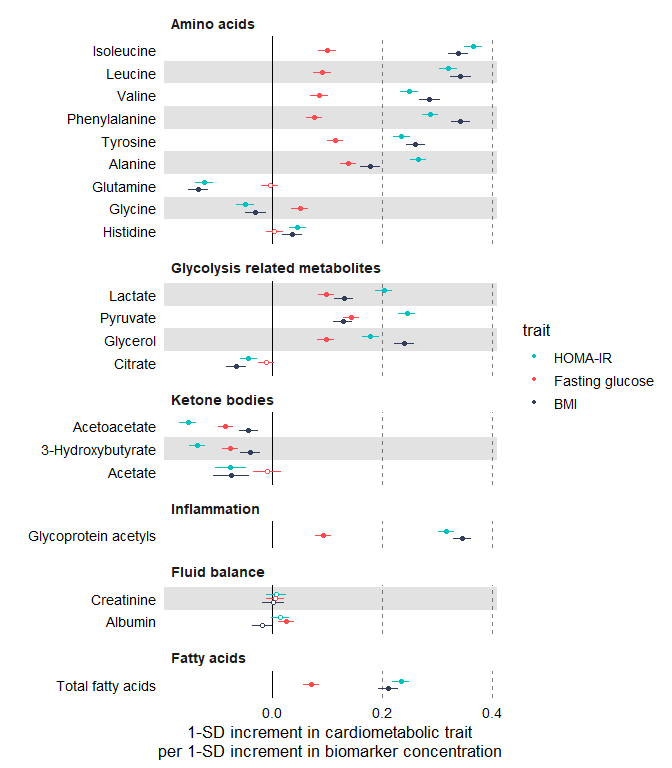

<!-- README.md is generated from README.Rmd. Please edit that file -->

<br>

<div style="text-align:left">

<span><a href="https://nightingalehealth.github.io/ggforestplot/index.html">
 </a>
<h2>

<strong>ggforestplot</strong>
</h2>

<h4>

Visualizing Measures of Effect
</h4>

</span>

</div>

<br>

`ggforestplot` is an R package for plotting measures of effect and their
confidence intervals (e.g. linear associations or log and hazard ratios,
in a forestplot layout, a.k.a. blobbogram).

The main plotting function is `ggforestplot::forestplot()` which will
create a single-column forestplot of effects, given an input data frame.

The two upstream vignettes [Using
ggforestplot](https://nightingalehealth.github.io/ggforestplot/articles/ggforestplot.html)
and [NMR data analysis
tutorial](https://nightingalehealth.github.io/ggforestplot/articles/nmr-data-analysis-tutorial.html)
provide an introduction to creating forestplot visualizations with
custom groupings and performing basic exploratory analysis (using demo
metabolic data of the [Nightingale Health NMR
platform](https://nightingalehealth.com/technology)).

> This package is fantastic, but I wanted to add some customisation.
> Hence this fork in my repo.

## Installation

You can install the original `ggforestplot` from NightingaleHealth, or
this fork to get my quality of life additions (described below):

``` r
#remotes::install_github("NightingaleHealth/ggforestplot")
remotes::install_github("lcpilling/ggforestplot")
```

If you want display package vignettes with `utils::vignette()`, install
with `build_vignettes = TRUE`.

## What’s new in v0.1.1 (this fork)?

This fork adds several quality-of-life features to
`ggforestplot::forestplot()`:

- `est_table`: print an aligned estimate + CI column to the right of the
  plot.
- `name = c(col1, col2, ...)`: use multiple columns for y-axis labels
  (to create table-like y-axis labels).
- `alpha`: make non-significant results semi-transparent.
- `filled_nonsig`: optionally keep non-significant points filled (useful
  with `alpha`).

See NEWS.md for the full change log.

## Examples

Below we briefly showcase the usage of `ggforestplot` with publicly
available datasets, which are also included in the package (see [A. V.
Ahola-Olli et
al. (2019)](https://www.biorxiv.org/content/10.1101/513648v1)).

### Linear associations

Plot a vertical forestplot for linear associations of blood biomarkers
to insulin resistance (HOMA-IR), fasting glucose and Body Mass Index
(BMI).

``` r
# Load tidyverse and ggforestplot
# install.packages("tidyverse")
library(tidyverse)
#> Warning: package 'readr' was built under R version 4.3.3
#> Warning: package 'lubridate' was built under R version 4.3.3
library(ggforestplot)

# Get subset of example, linear associations, data frame
df_linear <-
  ggforestplot::df_linear_associations %>%
  dplyr::arrange(name) %>%
  dplyr::filter(dplyr::row_number() <= 30)

# Forestplot
forestplot(
  df = df_linear,
  estimate = beta,
  logodds = FALSE,
  colour = trait,
  title = "Associations to metabolic traits",
  xlab = "1-SD increment in cardiometabolic trait
  per 1-SD increment in biomarker concentration"
)
```

<!-- -->

### Add transparency for non-significant results (`alpha`)

``` r
ggforestplot::forestplot(
  df = df_linear,
  name = name,
  estimate = beta,
  pvalue = pvalue,
  logodds = FALSE,
  colour = trait,
  alpha = 0.33,
  filled_nonsig = TRUE,
  title = "Associations to metabolic traits",
  xlab = "1-SD increment in cardiometabolic trait per 1-SD increment in biomarker concentration"
)
```

<!-- -->

### Add an estimate table (`est_table`)

Only do this if one estimate per row – too busy if using “colour” or
“shape”

``` r
ggforestplot::forestplot(
  df = df_linear |> filter(trait=="BMI"),
  name = name,
  estimate = beta,
  pvalue = pvalue,
  logodds = FALSE,
  alpha = 0.33,
  filled_nonsig = TRUE,
  est_table = TRUE,
  title = "Associations with BMI",
  xlab = "1-SD increment in BMI per 1-SD increment in biomarker concentration"
)
```

<!-- -->

### Odds ratios

Plot a vertical forestplot for odds ratios of blood biomarkers with risk
for future type 2 diabetes; visualize all 4 available cohorts and their
meta-analysis.

``` r
# Get subset of example, log odds ratios, data frame
df_logodds <-
  df_logodds_associations %>%
  dplyr::arrange(name) %>%
  dplyr::left_join(ggforestplot::df_NG_biomarker_metadata, by = "name") %>% 
  dplyr::filter(group == "Amino acids") %>%
  # Set the study variable to a factor to preserve order of appearance
  # Set class to factor to set order of display.
  dplyr::mutate(
    study = factor(
      study,
      levels = c("Meta-analysis", "NFBC-1997", "DILGOM", "FINRISK-1997", "YFS")
    )
  )

# Forestplot
forestplot(
  df = df_logodds,
  estimate = beta,
  logodds = TRUE,
  colour = study,
  shape = study,
  title = "Associations to type 2 diabetes",
  xlab = "Odds ratio for incident type 2 diabetes (95% CI)
  per 1−SD increment in metabolite concentration"
) +
  # You may also want to add a manual shape scale to mark meta-analysis with a
  # diamond shape
  ggplot2::scale_shape_manual(
    values = c(23L, 21L, 21L, 21L, 21L),
    labels = c("Meta-analysis", "NFBC-1997", "DILGOM", "FINRISK-1997", "YFS")
  )
```

<!-- -->

#### Multi-column y-axis labels (`name = c(...)`)

``` r
# Forestplot
forestplot(
  df = df_logodds,
  name = c(name, abbreviation),
  estimate = beta,
  logodds = TRUE,
  colour = study,
  shape = study,
  title = "Associations to type 2 diabetes",
  xlab = "Odds ratio for incident type 2 diabetes (95% CI)
  per 1−SD increment in metabolite concentration"
) +
  # You may also want to add a manual shape scale to mark meta-analysis with a
  # diamond shape
  ggplot2::scale_shape_manual(
    values = c(23L, 21L, 21L, 21L, 21L),
    labels = c("Meta-analysis", "NFBC-1997", "DILGOM", "FINRISK-1997", "YFS")
  )
```

<!-- -->

#### Example with grouping

Requires {ggforce} package

``` r
library(ggforce)

# add grouping variable
df_linear_groups <-   ggforestplot::df_linear_associations |>
  dplyr::filter(name %in% ggforestplot::df_linear_associations$name[1:20]) |>
    dplyr::left_join(df_NG_biomarker_metadata, by="name") |>
    dplyr::mutate(
    group = factor(.data$group, levels = unique(.data$group))
  )

# Forestplot
forestplot(
  df = df_linear_groups,
  estimate = beta,
  pvalue = pvalue,
  psignif = 0.002,
  xlab = "1-SD increment in cardiometabolic trait\nper 1-SD increment in biomarker concentration",
  colour = trait
) +
  ggforce::facet_col(
    facets = ~group,
    scales = "free_y",
    space = "free"
  )
```

<!-- -->
